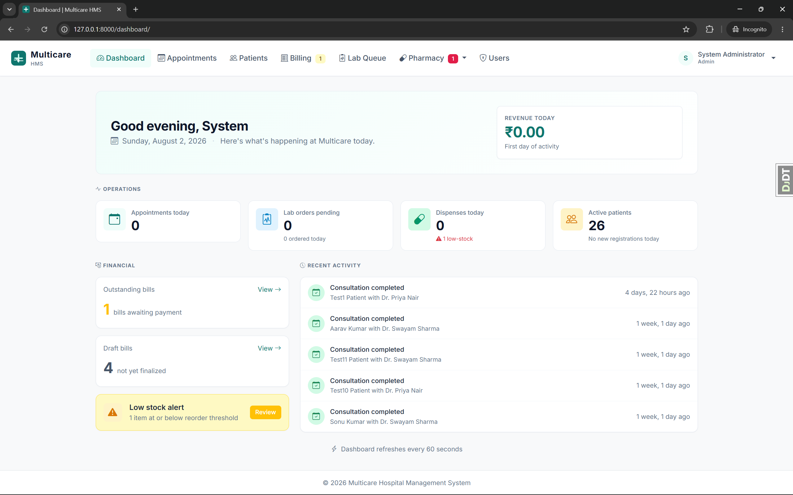
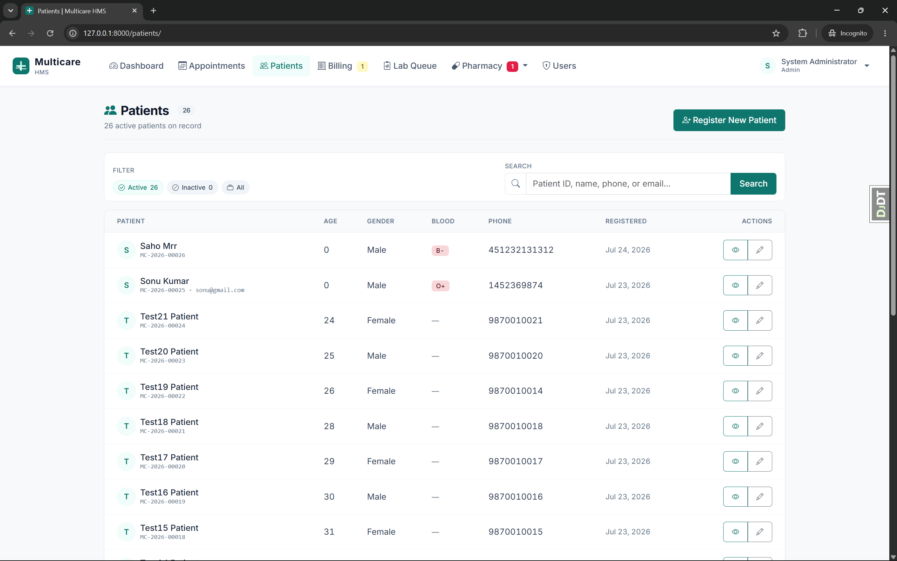
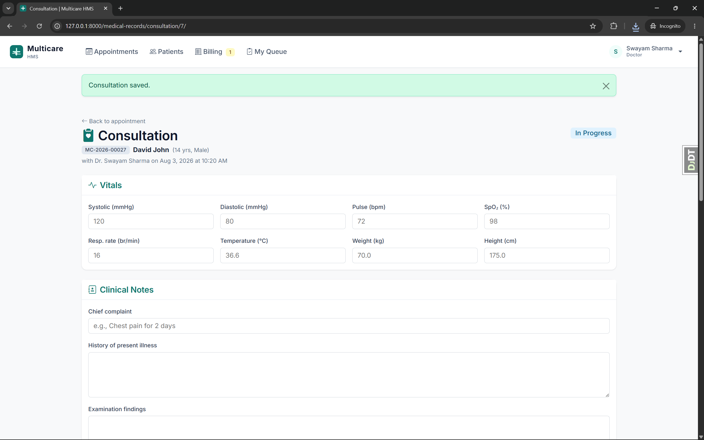
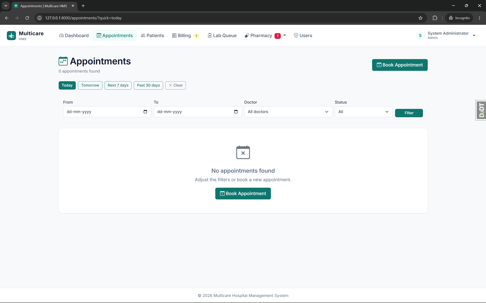
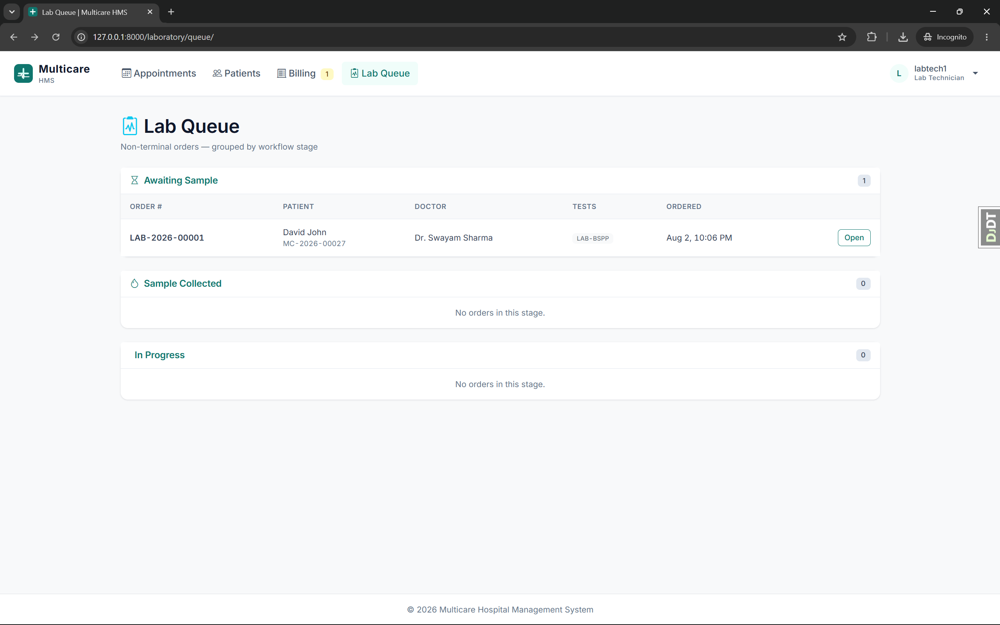
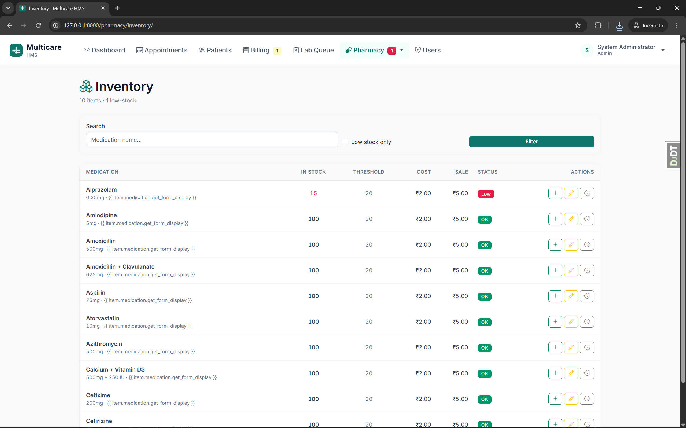

# Multicare HMS

**🚀 Live demo:** [multicare-hms.onrender.com](https://multicare-hms.onrender.com)

Login credentials available on request. *(First load takes ~30 seconds — free tier spins down when idle.)*

[](https://github.com/swayam0406/multicare-hms/actions/workflows/ci.yml)
[](https://www.python.org/)
[](https://www.djangoproject.com/)
[](LICENSE)

A production-shaped hospital management system covering the full clinical operations lifecycle — patient registration, appointments, EMR, billing, laboratory, and pharmacy — built with Django 5.2 and PostgreSQL over 8 iterative sprints.

**316 passing tests · 10 sprint commits.**



## Highlights

- **Full clinical workflow** — patient lifecycle, appointment state machine with 6 statuses, consultation form with vitals + diagnoses + prescriptions, patient clinical history timeline
- **Billing pipeline** — `INV-YYYY-NNNNN` invoices with `select_for_update` locking, 6-status state machine, immutable payments and refunds, insurance claims
- **Laboratory** — order lifecycle with 5-status state machine, per-item result entry, `LAB-YYYY-NNNNN` numbering, auto-billing signal on completion, 20 seeded lab test profiles
- **Pharmacy** — atomic inventory drawdown with `select_for_update`, immutable stock movement audit log, dispense state machine, multi-item transaction atomicity
- **Cross-app orchestration** — lab and pharmacy signals auto-append charges to the visit's bill via a dedicated `Bill.system_add_item()` bypass with idempotency guarantees
- **Role-based access** — 7 roles (Admin, Doctor, Nurse, Receptionist, Patient, Lab Tech, Pharmacist), mixin-based access control on every view
- **PDF exports** — bill invoices, prescriptions, and lab reports rendered via xhtml2pdf with per-role access checks
- **Production niceties** — self-service password reset, admin user provisioning UI, live dashboard with cached counters, coverage-measured tests

## Stack

- **Backend:** Django 5.2 LTS, PostgreSQL 16, Python 3.14
- **Frontend:** Server-rendered Django templates + Bootstrap 5 + custom design system
- **PDFs:** xhtml2pdf (no C dependencies)
- **Tests:** Django test runner, coverage.py
- **Tooling:** Black, Ruff, django-debug-toolbar, python-decouple

## Screenshots

| Dashboard | Patient list | Consultation |
|---|---|---|
|  |  |  |

| Appointments | Lab queue | Inventory |
|---|---|---|
|  |  |  |

## Architecture at a glance

Ten Django apps decoupled through signals rather than direct imports. When a lab order completes, a signal fires that the billing app receives — billing appends the lab items to the visit's bill without either app knowing about the other's internals.

```
patient → appointment → consultation → diagnosis + prescription
                                    ↘
                                    lab order → results → bill
                                    ↘
                                    dispense → inventory drawdown → bill
```

Key architectural decisions:

- **State machines** on Bill, Appointment, LabOrder, Dispense — each with an `ALLOWED_TRANSITIONS` dictionary and a `can_transition_to()` method
- **`Bill.system_add_item()`** — the only way to add items after bill finalization, used exclusively by back-of-house signals
- **`is_billed` idempotency flags** on LabOrderItem and DispenseItem — prevent double-billing if signals fire twice
- **`select_for_update` locking** on all sequence generators to prevent race conditions
- **Immutable financial records** — Payment, Refund, StockMovement enforce immutability at `clean()`, admin `has_change_permission=False`, and `delete()` raising `ValidationError`

## Running locally

Prerequisites: Python 3.14, PostgreSQL 16, virtualenv.

```bash
git clone <repo-url>
cd multicare-hms

python -m venv venv
.\venv\Scripts\Activate.ps1   # Windows PowerShell
# source venv/bin/activate    # macOS / Linux

pip install -r requirements.txt

createdb multicare_hms
cp .env.example .env          # then edit with your DB credentials

python manage.py migrate
python manage.py seed_services
python manage.py seed_lab_tests
python manage.py seed_catalogs
python manage.py createsuperuser

python manage.py runserver
```

Visit `http://127.0.0.1:8000/`.

## Test users (dev DB only)

| Role | Username | Password |
|---|---|---|
| Admin | `admin` | `Admin@12345` |
| Doctor | `dr_sharma` | `Doctor@123` |
| Patient | `sonu` | `Patient@123` |
| Lab Tech | `labtech1` | `LabTech@123` |
| Pharmacist | `pharma1` | `Pharma@123` |

## Testing

```bash
python manage.py test               # 316 tests
coverage run manage.py test         # run under coverage
coverage report                     # console report
coverage html                       # open htmlcov/index.html
```

## Sprint history

Each sprint is one commit on `main`. Run `git log --oneline` to see the arc:

- **Sprint 1** — Foundation: Django scaffold, PostgreSQL, base template
- **Sprint 2** — Custom User model with 7 roles, RBAC mixins
- **Sprint 3** — Patient lifecycle with `MC-YYYY-NNNNN` IDs
- **Sprint 4** — Appointments with 6-status state machine
- **Sprint 5** — EMR: MedicalRecord, Vitals, Diagnoses, Prescriptions
- **Sprint 6** — Billing: `INV-YYYY-NNNNN`, payments, refunds, insurance
- **Sprint 7** — Laboratory + Pharmacy with cross-app auto-billing
- **Sprint 8** — PDFs, password reset, user provisioning, dashboard, coverage
- **Sprint 9-lite** — Visual polish, design system

## Known limits

- Single-hospital scale — not multi-tenant
- LocMemCache in dev; Redis planned for production
- No deployment configuration yet (Dockerfile, gunicorn, WhiteNoise pending)
- Doctor profile creation still requires Django admin
- In-app notifications not implemented (deferred — needs a real delivery channel to be meaningful)

## License

MIT.
## Deployment

Deployed on [Render.com](https://render.com) as a Docker container with managed PostgreSQL 16.

- Continuous deployment from `main` — every merge triggers a fresh deploy
- Zero-downtime rolling updates via Render's platform
- Health checks at `/health/`
- Static files served via WhiteNoise (compressed + manifest cached)
- HSTS, secure cookies, HTTPS-only in production
- Idempotent bootstrap command auto-provisions admin + seed data on every deploy

Infrastructure defined in [`render.yaml`](render.yaml) — a full IaC blueprint declaring the web service, database, health check, and environment variables.

Local containerized development uses the same Dockerfile:

```bash
docker compose up
```

See the [Dockerfile](Dockerfile) and [docker-compose.yml](docker-compose.yml) for details.